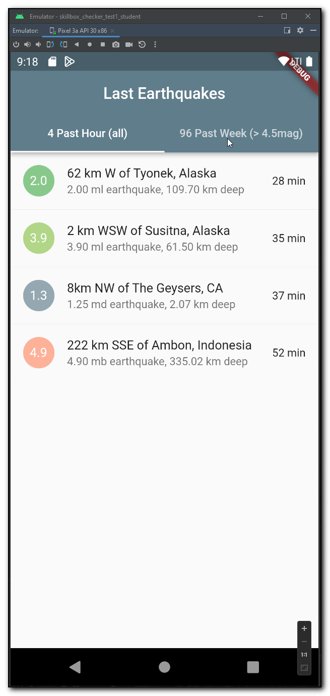
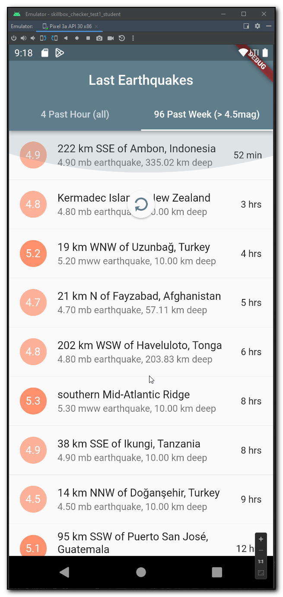

# LastHourEarthquakes

Bloc sample taken from:

https://dev.to/offlineprogrammer/flutter-getting-started-with-the-bloc-pattern-streams-http-request-response-1mo3

Json fields:
https://earthquake.usgs.gov/earthquakes/feed/v1.0/geojson.php

https://earthquake.usgs.gov/earthquakes/feed/v1.0/summary/all_hour.geojson

https://earthquake.usgs.gov/earthquakes/feed/v1.0/summary/4.5_week.geojson

